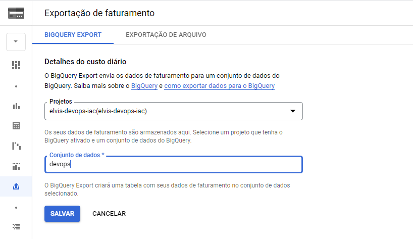
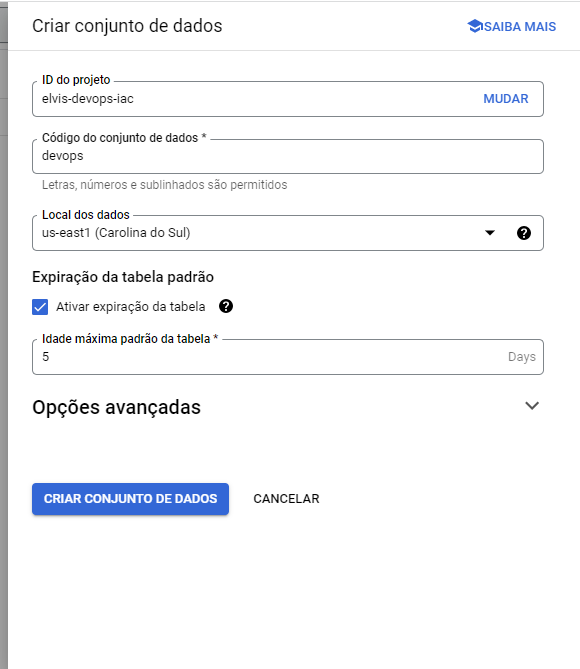
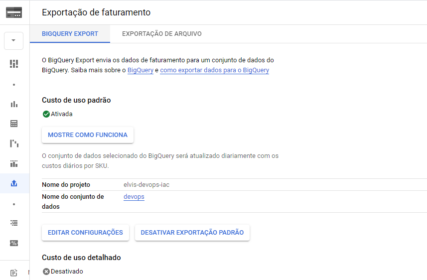

### Olá!!! 👋

  
 Esse repositório contém os prints das configurações de uma Exportação do Billing no Google Cloud.

  

 

📌 Início:

 

 

📌 Criando conjunto de dados:

 

 

📌 Concluído:

 

 

